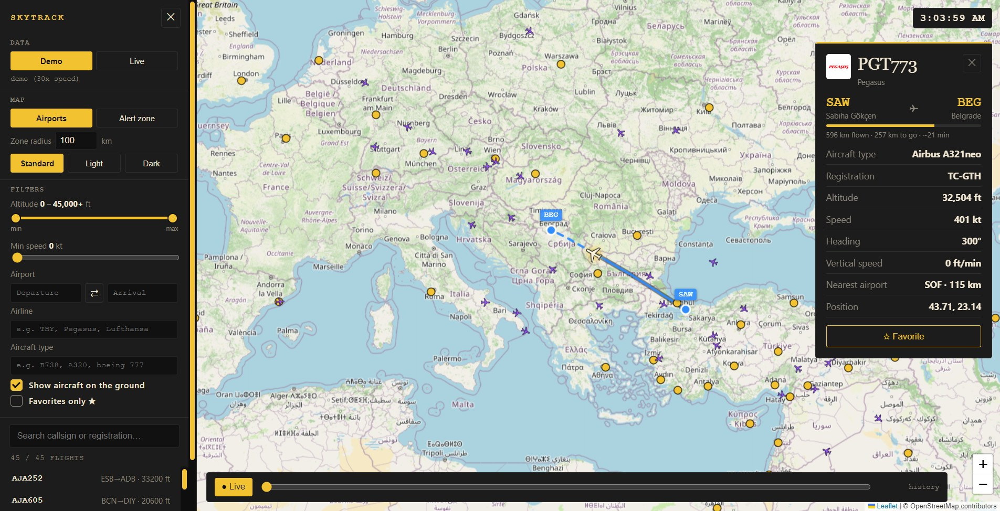

<p align="center"></p>

# SkyTrack

**English** · [Türkçe](README.tr.md)

[](https://github.com/SametDuhan/airock/actions/workflows/test.yml) [](LICENSE) 

SkyTrack is a free desktop app for tracking flights live on a map, similar to Flightradar24. It runs on Windows, macOS and Linux, and it uses open ADS-B data, so you don't need an account or an API key.



## Features

- **Live flights**: aircraft positions refresh every 15 seconds. When you move or zoom the map, the new area loads right away.
- **Demo mode**: 45 simulated flights that need no internet connection. Time runs 30× faster.
- **Flight details**: click a plane to see:
  - its airline and logo, aircraft type, registration and a photo (when one is available)
  - its route (departure → arrival), progress bar, distance left and estimated time left
  - its altitude, speed and vertical speed, head/tail wind, and a rough fuel and CO₂ estimate for the rest of the flight (with a bar for the estimated fuel left)
  - a **turbulence** line: green when no turbulence is reported or forecast on the route ahead at its altitude, yellow for moderate, red for high (SIGMET / G-AIRMET advisories and recent pilot reports)
  - the flag of the country it is registered in, and an estimated arrival time
- **Route and trail**: the route is drawn as a great-circle arc, the actual shortest path over the globe. The trail shows where the plane has flown over the last ~30 minutes. In live mode the flown part follows the plane's real track, and it starts at the departure airport, so an earlier flight of the same aircraft never leaks into the line.
- **Airport panel**: click an airport (yellow dot) to open a panel on the right with:
  - a photo of the airport, and the city and country it is in
  - the current weather: temperature, wind, gusts, humidity, pressure and visibility
  - **Arrivals** and **Departures** lists of the aircraft you can see; click one to open its flight card, just like clicking it on the map
- **Filters**:
  - an altitude range on one slider (left handle = minimum, right handle = maximum)
  - a speed range (left handle = minimum, right handle = maximum)
  - departure and/or arrival airport, by code (IST, LTFM) or city name
  - aircraft on the ground on or off, and a favorites-only option
- **Emergencies**: an aircraft squawking 7500, 7600 or 7700 gets a blinking red ring and a notification, and the list shows ⚠.
- **Watchlist**: press **🔔 Watch** on a flight card. SkyTrack asks for your watched aircraft anywhere in the world every 45 seconds and notifies you when one takes off or lands.
- **Today's flights**: on a live flight card, **Today's flights** lists every flight the aircraft made today (times, distance, top altitude). Click one to draw it on the map.
- **Rain radar**: the **Radar** button adds a live precipitation layer. The airport panel also shows the airport's METAR and TAF, with its VFR/IFR flight category.
- **Map layers**: besides rain radar, the **Turbulence** button draws SIGMET / G-AIRMET turbulence areas, **Wind** draws wind arrows (pick the flight level in the selector that appears) and **Night** shades the night side of the Earth.
- **Foldable menu**: click a section title in the left menu (Data, Mode, Map, Filters, Aircraft) to fold it. SkyTrack remembers what you folded.
- **Plane spotter mode**: switch to it under **Mode**. It adds a logbook (**📓 Log sighting** on a flight card, CSV export), *new aircraft* / *new type* badges, and extra details (ICAO24, squawk, category). In normal mode none of this is shown.
- **English and Turkish**: the **TR / EN** button at the top of the menu switches the whole interface. It starts in your system language.
- **Favorites**: star a flight (☆) to find it again later.
- **Alert zone** (*Alert zone*): click the map to set a circle (100 km by default; change the radius in the menu, 10–500 km). You get a notification when an aircraft enters it, including one that first appears inside it.
- **Replay**: rewind the last hour with the slider at the bottom, then press *● Live* to return to live.
- **Map styles**: Standard, Light or Dark. The mouse cursor and the filter checkboxes use SkyTrack's yellow and black look.
- **Fast with many planes**: all aircraft are drawn on a single canvas. Around 3,700 aircraft over Europe draw in about 8 ms.

## Download

Get the installer for your system from the [latest release](https://github.com/SametDuhan/airock/releases/latest) (`.exe` for Windows, `.dmg` for macOS, AppImage for Linux). No account needed. To run from source instead, see below.

## Getting started

You need [Node.js](https://nodejs.org) 18 or newer.

```bash
git clone https://github.com/SametDuhan/airock.git
cd airock
npm install
npm start
```

To build an installer for your operating system (`.exe`, `.dmg` or AppImage), run:

```bash
npm run dist
```

The installer is created in the `dist/` folder.

The repository is named `airock`; the app itself is SkyTrack. Your filters and alert zone are remembered between sessions. Run the tests with `npm test`.

## How to use

| I want to… | Do this |
|---|---|
| See real flights | In the left menu, click **Live**. **Demo** switches back to simulated flights. |
| See an airport's weather, arrivals and departures | Click the airport's yellow dot on the map. Switch between **Arrivals** and **Departures**, click a flight to open it. Close the panel with **✕**. |
| Be told when a plane takes off or lands | Open it and press **🔔 Watch**. Watched planes appear under *Watchlist* in the menu. |
| Keep a spotting log | Under **Mode** choose **Plane spotter**, open a flight and press **📓 Log sighting**. **Open logbook** shows everything; **Export CSV** saves it. |
| Get details about a plane | Click the plane on the map or in the list. Close the card with **✕**. |
| Find a flight | Type a callsign (e.g. `THY1`) or registration (e.g. `TC-JPN`) into the search box. |
| Show only flights from Istanbul to Frankfurt | Under *Filters*, type `IST` into **Departure** and `FRA` into **Arrival**. Fill in only one box to see all departures or all arrivals for that airport. |
| Hide or show the side menu | Click **✕** at the top of the menu. Click **☰** on the map to bring it back. |
| Go back in time | Drag the slider at the bottom of the map. |

## Data sources

| Data | Source | Notes |
|---|---|---|
| Aircraft positions, zoomed in | [adsb.lol](https://adsb.lol) and [adsb.fi](https://adsb.fi) | Free, no key. Both have strict rate limits, so SkyTrack spreads its requests over the two and falls back to the other one on an error. A wide view covers about twice as much as with one source. |
| Aircraft positions, wide view or backup | [OpenSky Network](https://opensky-network.org) | Covers a large area in one request. Has a low daily limit for anonymous users. |
| Route, aircraft type, registration, photo | [adsbdb.com](https://www.adsbdb.com) | Free, no key. Some flights may be missing or out of date. |
| Airline logos | images.kiwi.com | |
| Airport weather, wind at flight levels | [Open-Meteo](https://open-meteo.com) | Free, no key. |
| METAR and TAF, turbulence advisories, pilot reports | [aviationweather.gov](https://aviationweather.gov) | Free, no key. Turbulence "none" means none reported or forecast, not a guarantee. |
| Rain radar | [RainViewer](https://www.rainviewer.com) | Free, no key. |
| Today's flights of an aircraft | [adsb.lol](https://adsb.lol) day traces | Free, no key. |
| Airport city and country | [OpenStreetMap Nominatim](https://nominatim.openstreetmap.org) | Free, no key. |
| Airport photo | [Wikipedia](https://en.wikipedia.org) | Shown when the airport has a Wikipedia page with a picture. |
| Maps | OpenStreetMap, Esri | |

All network requests are in [`src/data.js`](src/data.js).

> Arrivals and departures in the airport panel come from the aircraft SkyTrack already sees (route within 600 km of the airport), not from a flight schedule, so flights that haven't taken off yet don't appear.

> Flightradar24's own data is a paid commercial API. SkyTrack uses only open, community-collected ADS-B data, so coverage can be thinner in some regions.

## Troubleshooting

- **The status shows an error, or few planes appear when zoomed out.**
  The free sources limit how many requests you can make. When OpenSky's daily limit runs out, SkyTrack shows only the center of the map and asks you to zoom in. Zooming in usually fixes it.
- **Live mode doesn't work when I open `src/index.html` in a browser.**
  The data sources only allow requests from the desktop app, not from a web page (they block cross-origin requests from browsers). Use `npm start`. Demo mode works in both.
- **A flight shows "Route info not found".**
  The route database doesn't know this callsign. The rest of the details still work.

## Project structure

```
main.js           Electron window; passes data requests from the app to src/data.js
preload.js        Exposes those requests to the app safely
src/index.html    Layout and styles
src/loader.js     Loads Leaflet (local copy first, CDN as a fallback), then the app
src/geo.js        Distance, bearing and great-circle helpers (unit-tested)
src/data.js       All data sources: flights, routes, aircraft info
src/renderer.js   Map, aircraft layer, flight card, list, filters, replay
src/extras.js     Emergencies, watchlist, today's flights, radar, spotter logbook, language switch
src/i18n.js       English / Turkish texts
docs/             Screenshots used in this README
```

Built with [Electron](https://www.electronjs.org) and [Leaflet](https://leafletjs.com).

## Contributing

Bug reports, ideas and pull requests are welcome. See [CONTRIBUTING.md](CONTRIBUTING.md) and the [`good first issue`](https://github.com/SametDuhan/airock/labels/good%20first%20issue) list. If SkyTrack is useful to you, a ⭐ helps other people find it.

Released under the [MIT License](LICENSE).
